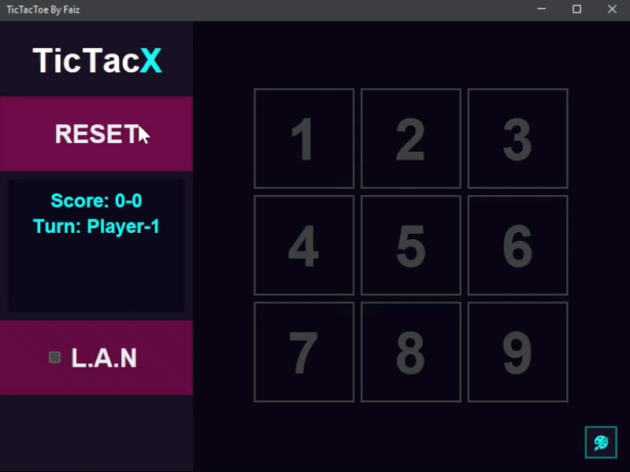
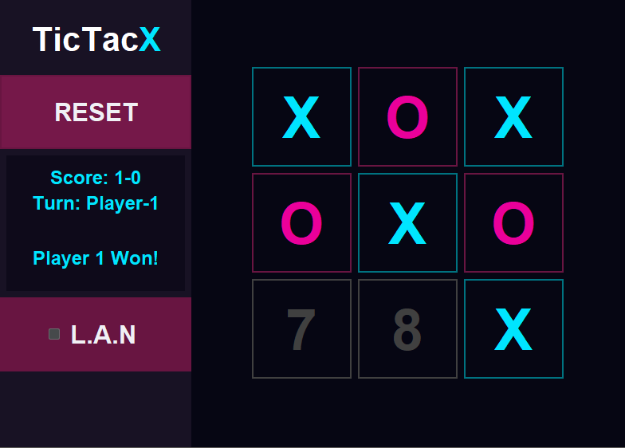
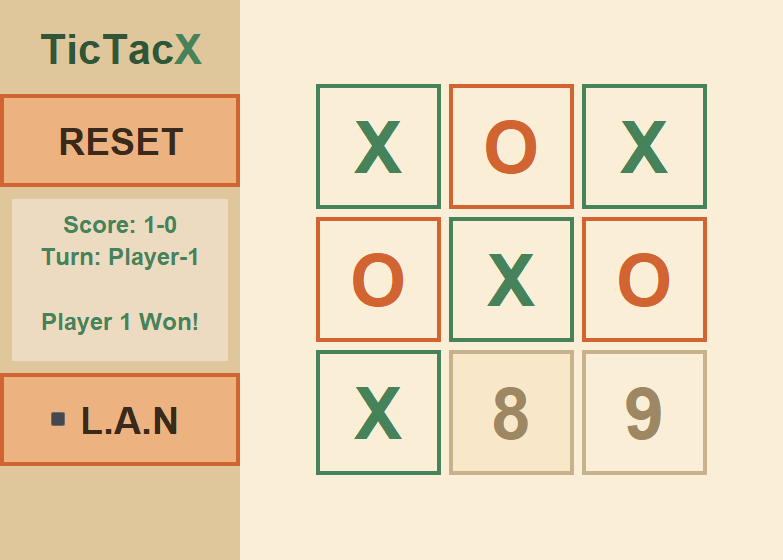
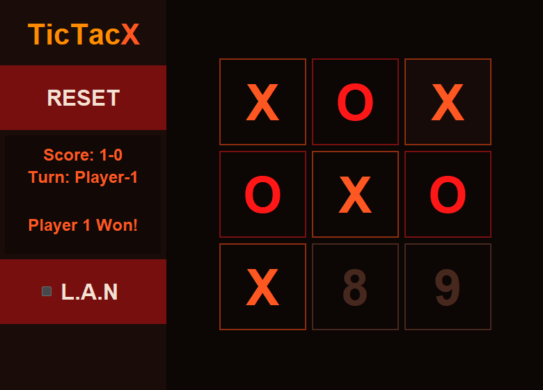
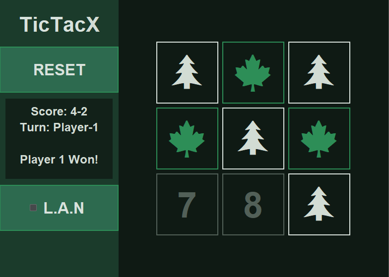

# Multiplayer TicTacToe
A **LAN** multiplayer TicTacToe game built with **Java** and **Swing**

## Preview
<p align="center">
  
</p>

## Features
* Complete 3x3 TicTacToe Base game.
* LAN multiplayer over sockets (host or join by IP)
* Live in-app theme switching.
* Multiple built-in themes (Dark, Light, Lava, Forest)
* Score and turn tracking across rounds
* Clean MVC separation (Game / GameGUI / GameController)

## Status
Paused / Archived.

## Controls
| Action                  | How                                       |
| ------------------------ | ------------------------------------------ |
| **Place a mark**         | Click any numbered cell                    |
| **Reset board**          | Click **RESET**                            |
| **Toggle multiplayer**    | Click **L.A.N**                            |
| **Host a game**           | Click **Server** (after enabling L.A.N)    |
| **Join a game**           | Click **Client**, then enter host's IP     |
| **Switch theme**          | Click the palette icon, bottom-right          |

## Building
### Prerequisites
* JDK 17+
* `lib/flatlaf-3.7.1.jar` (already included)

### Windows
```bash
javac -cp "lib/flatlaf-3.7.1.jar" -d bin (Get-ChildItem -Recurse -Filter *.java src | ForEach-Object { $_.FullName })
java -cp "bin;lib/flatlaf-3.7.1.jar" src.Main
```

### Linux / macOS
```bash
find src -name "*.java" > sources.txt
javac -cp "lib/flatlaf-3.7.1.jar" -d bin @sources.txt
java -cp "bin:lib/flatlaf-3.7.1.jar" src.Main
```

Or just run/debug `src/Main.java` directly from VS Code (Java extension handles the classpath automatically via `.vscode/launch.json`).

## Output
Compiled `.class` files are generated in `/bin`:


## Themes
<p align="center">
  
  &nbsp;&nbsp;
  
  <br /><br />
  
  &nbsp;&nbsp;
  
</p>

## Adding a New Theme
1. Duplicate an existing theme class in `src/model/themes` (e.g. `DarkTheme.java`) and rename it.
2. Modify its `apply()` method - set your own `Theme.Colors`, `Theme.Fonts`, `Theme.Borders`, and `Theme.Symbols` values.
3. Register it by adding `YourTheme::apply` to the `THEMES` array in `GameController.java`:
```java
private static final Runnable[] THEMES = {
    DarkTheme::apply,
    LightTheme::apply,
    LavaTheme::apply,
    ForestTheme::apply,
    YourTheme::apply   // add here
};
```
it will appear in the theme button's cycle automatically.